# 主链路时序图

本文档聚焦当前产品最关键的两条链路：

1. `创建会话 -> 创建研究任务 -> 运行任务 -> 获取 workspace`
2. `继续对话 -> 写消息 -> 创建 follow-up task`

目的不是炫图，而是知道：

- 用户点一次按钮后，系统到底发生了什么
- 哪一层该做什么
- 哪一层不该做什么

---

## 1. 主链路时序图

```mermaid
sequenceDiagram
    participant U as User
    participant FE as Frontend
    participant API as FastAPI Route
    participant H as ProductApiHandlers
    participant CS as ConversationService
    participant MS as MessageService
    participant RS as ResearchService
    participant AG as research_agent.pipeline
    participant WM as workspace_mapper
    participant WS as WorkspaceService
    participant WR as WorkspaceRepository

    U->>FE: 输入 topic 并创建会话
    FE->>API: POST /conversations
    API->>H: create_conversation(request)
    H->>CS: create_conversation(topic, title)
    CS-->>H: Conversation
    H-->>API: ApiResponse
    API-->>FE: conversation_id

    U->>FE: 创建研究任务
    FE->>API: POST /research/tasks
    API->>H: create_research_task(request)
    H->>RS: create_task(conversation_id, topic, mode)
    RS-->>H: ResearchTask
    H-->>API: ApiResponse
    API-->>FE: task_id

    U->>FE: 运行研究任务
    FE->>API: POST /research/tasks/{task_id}/run
    API->>H: run_research_task(task_id)
    H->>RS: get_task(task_id)
    RS-->>H: ResearchTask
    H->>RS: run_task(task)
    RS->>AG: run_pipeline(topic)
    AG-->>RS: agent state
    RS->>WM: workspace_from_agent_state(task_id, topic, state)
    WM-->>RS: ResearchWorkspace
    RS->>WR: save(workspace)
    WR-->>RS: saved
    RS-->>H: ResearchWorkspace
    H-->>API: ApiResponse
    API-->>FE: task result summary

    FE->>API: GET /research/tasks/{task_id}/workspace
    API->>H: get_workspace(task_id)
    H->>WS: get_workspace_snapshot(task_id)
    WS->>WR: get_by_task(task_id)
    WR-->>WS: ResearchWorkspace
    WS-->>H: WorkspaceSnapshotResponse
    H-->>API: ApiResponse
    API-->>FE: workspace snapshot

    U->>FE: 在对话页继续追问
    FE->>API: POST /conversations/continue
    API->>H: continue_conversation(request)
    H->>CS: get_conversation(conversation_id)
    CS-->>H: Conversation
    H->>MS: create_message(...)
    MS-->>H: MessageRecord
    H->>MS: get_recent_context(...)
    MS-->>H: recent messages
    H->>RS: create_follow_up_task(...)
    RS-->>H: ResearchTask
    H-->>API: ApiResponse(message_id, context_preview, follow_up_task)
    API-->>FE: continue response
```

---

## 2. 每一层在干什么

### Frontend

职责：

- 收集用户输入
- 调 HTTP 接口
- 展示结果

不该做：

- 生成 task_id
- 理解旧版 Agent 内部 state
- 拼业务逻辑

### FastAPI Route

对应文件：

- `product_agent/api/fastapi_app.py`

职责：

- 定义路由
- 接请求
- 交给 handler

不该做：

- 复杂业务逻辑
- 数据存取

### ProductApiHandlers

对应文件：

- `product_agent/api/handlers.py`

职责：

- 参数接入
- 调 service
- 包统一响应

不该做：

- 直接访问 repository
- 直接跑外部工具

### Service 层

对应文件：

- `conversation_service.py`
- `message_service.py`
- `research_service.py`
- `workspace_service.py`

职责：

- 业务逻辑中心
- 编排 repository、registry、agent pipeline

不该做：

- 把旧原型内部状态直接丢给前端

### Repository 层

对应文件：

- `product_agent/repositories/base.py`
- `product_agent/repositories/memory_store.py`

职责：

- 数据读写边界
- 提供统一持久化抽象

最重要的理解：

- 数据怎么存、怎么取：放在 `repository`
- 什么时候存、什么时候取：由 `service` 决定

### research_agent / pipeline

对应文件：

- `product_agent/research_agent/pipeline.py`

职责：

- 执行研究分析主流程
- 返回分析状态

### Workspace Mapper

对应文件：

- `product_agent/services/workspace_mapper.py`

职责：

- 把分析状态映射成产品工作台对象

这是非常关键的一层，因为它阻止了：

**前端直接依赖旧版或内部 Agent state。**

---

## 3. 当前主链路里还缺什么

这两条链路已经能跑通最小闭环，但还没完全产品化。

当前仍需要继续补：

### 3.1 更强的 follow-up 任务策略

- 基于上下文自动决定是否立即运行 follow-up task
- 更真实的上下文摘要压缩

### 3.2 历史查询能力

- conversation list
- task list
- history page backend support

### 3.3 workspace 字段继续收紧

- taxonomy
- graph_edges
- trace

### 3.4 异步任务链路

- 当前任务仍是同步执行
- 后续可能要支持后台运行和状态轮询

---

## 4. 一句话总结

这套主链路现在已经比旧原型更工程化了，因为它明确分开了：

- route 收请求
- handler 转调
- service 编排逻辑
- repository 负责存取
- pipeline 负责分析
- mapper / workspace service 负责投影

这条边界守住了，后面接数据库、接历史页、接 RAG 都会顺很多。
