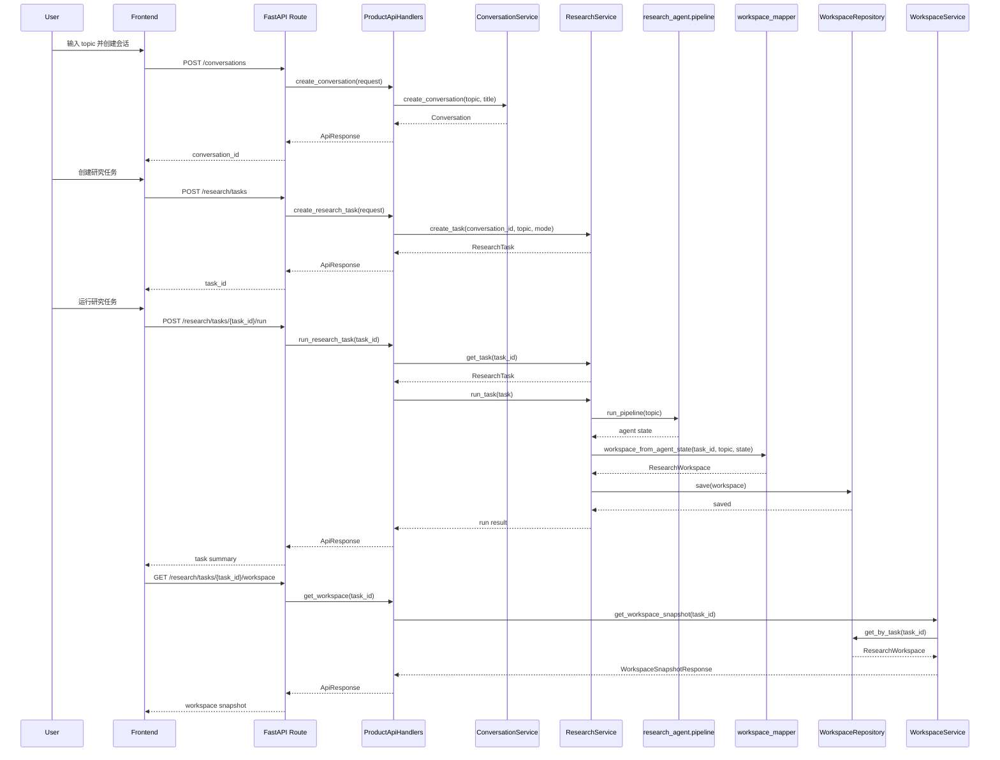
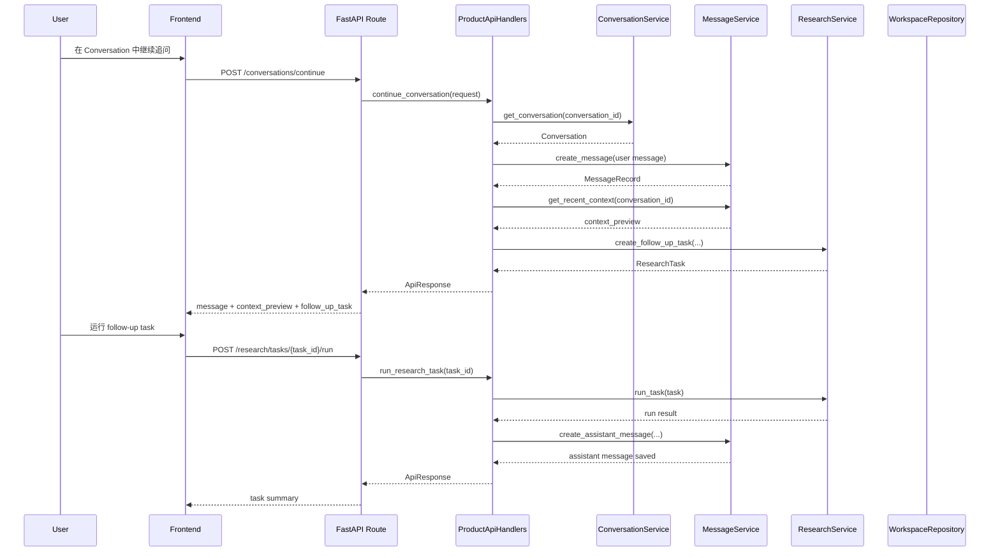

# 主链路时序图

本文档只讲当前最关键的两条链路：

1. `创建会话 -> 创建任务 -> 运行任务 -> 读取 workspace`
2. `继续对话 -> 写消息 -> 创建 follow-up task -> 回写 assistant 回复`

这份文档的作用不是装饰，而是帮助组员在开发时想清楚：

- 用户点一次按钮后，系统到底做了哪些事
- 哪一层该做什么
- 哪一层不该越界

---

## 1. 主链路一：创建任务并读取工作台

---

## 2. 主链路二：继续对话并触发 follow-up task

---

## 3. 这两条链路里每层各负责什么

### Frontend

负责：

- 发请求
- 显示结果
- 管理页面状态

不负责：

- 直接拼 taxonomy coverage
- 直接理解旧版 agent state
- 跨过 API 去猜后端内部结构

### FastAPI Route + Handler

负责：

- 接参数
- 调 service
- 返回统一响应

不负责：

- 直接写 SQL
- 直接改 repository 内部状态
- 直接手搓复杂分析逻辑

### Service

负责：

- 编排业务逻辑
- 决定什么时候创建消息、什么时候创建任务、什么时候保存 workspace

不负责：

- 页面展示
- 直接承担图形渲染含义

### research_agent

负责：

- 真正跑分析流程
- 产出 agent state

不负责：

- 直接生成前端页面结构

### Repository

负责：

- 持久化 conversation / message / task / workspace / knowledge

不负责：

- 决定业务流程

---

## 4. 当前已经打通的部分

已经真实打通：

- 创建会话
- 创建任务
- 运行任务
- 读取 workspace
- 继续对话
- follow-up task 创建
- assistant 任务结果回写消息
- SQLite 持久化

也就是说：

**Conversation -> Message -> ResearchTask -> Workspace**  
这条关系链在后端数据层面已经成立。

---

## 5. 当前还没完全闭环的部分

### 5.1 Conversation 体验还不像完整研究会话

虽然 assistant message 已经会回写，但现在更多还是“任务摘要”，还不够像一段自然回答。

### 5.2 Knowledge / RAG 还没真正插进主链

现在的主链路仍主要依赖：

- 当前用户输入
- 最近会话消息
- 外部检索结果

而不是：

- 历史知识沉淀
- 用户导入论文
- 检索增强知识片段

### 5.3 Workspace 仍偏“结果面板”

还需要继续往：

- 更自然的阅读顺序
- 更强的图谱解释
- 更清晰的 taxonomy / graph 联动

方向优化。

---

## 6. 组员实现时最容易踩的坑

1. 在前端自己重算 coverage 或 gap 数
2. 在 handler 里直接访问 repository
3. 在某个页面里直接假设 task 一定已经完成
4. 在 `continue_conversation` 里只写用户消息，不回写 assistant 结果
5. 把 `KnowledgeService` 当成“已经完整接入 RAG”

---

## 7. 一句话总结

当前系统主链路已经从“页面占位”走到了：

**可创建会话、可发追问、可触发任务、可保存结果、可读取工作台的真实工程链路。**

下一阶段重点不再是“有没有链路”，而是：

**让这条链路更自然、更稳定、更像真正的持续研究助手。**
