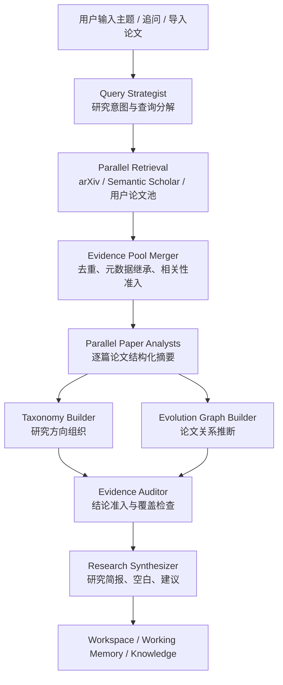

# 产品化与 Agent 重构路线图

更新时间：2026-06-17

本文以当前代码为准，用来统一下一阶段开发思路。现有文档中关于任务清单和验收的内容仍然有参考价值，但后续推进不应再围绕“补功能数量”，而应围绕“用户为什么不用直接问 AI，而要用我们的科研调研助手”来组织。

当前落地记录：

- 2026-06-16：已完成 Phase 1.1 后端基础，新增 research task 运行事件模型、SQLite/内存仓库、`GET /research/tasks/{task_id}/events` 接口，并把 pipeline `state_callback` 接入事件记录。
- 2026-06-16：已完成 Phase 1.2 第一版，`/conversations/continue` 支持默认后台运行 follow-up task，前端发送追问后会轮询 task/events，任务完成后自动刷新历史并跳转到本次结果。
- 2026-06-16：已完成 Phase 1.3 第一版，首次生成和追问生成都已接入运行事件轮询，并在对话页展示轻量 Agent 运行卡片。下一步不再停留在日志列表，应升级为可点击、可跳转、可解释的 Agent DAG 状态图。
- 2026-06-16：已完成 Phase 2.0 前端首屏雏形，工作台顶部已加入证据判断、优先阅读论文和下一步动作。但当前仍复用旧 `summary` 文本，信息价值不稳定；下一步应以后端结构化 `research_brief` 替代原始总结。
- 2026-06-16：已完成 Phase 2.1 第一版，workspace 响应新增结构化 `research_brief`，前端 Overview 首屏优先展示研究简报、关键发现、必读论文、下一步动作和风险边界；旧 `summary` 仅作为兼容回退。
- 2026-06-16：已完成 Phase 5.1 第一版，工作台加入 Overview / Evidence / Map / Context / Run 分区导航；Run 区新增轻量 Agent 运行路径图，用现有 workspace 数据展示阶段完成、降级和待生成状态。
- 2026-06-16：已推进 Phase 5.2 / Phase 3.1 小切片，Run 区开始接入真实 task events 轮询并显示运行中/失败/降级节点，工作台触发生成会自动切到 Run 区；Overview 的优先阅读论文增加“做了什么 / 为什么先读”速览，先把等待可视化和论文解释力补起来。
- 2026-06-16：已推进 Phase 3.1 第一版，workspace `papers` 增加结构化 `paper_brief`，Evidence 论文详情展示研究问题、方法/模型、主要贡献、局限/注意和与当前主题关系；当前生成以摘要/元数据/相关性理由为主，后续可替换为 LLM/PDF 正文分析。
- 2026-06-16：已推进 Phase 1.3 / Phase 5.2 等待态升级，对话页首次生成和追问运行中不再展示竖向日志，而是展示 Agent Node 运行图；节点包括 Planner、Searcher、Taxonomy、Evolution、Auditor、Corrector、Synth 和 Result，当前节点动态高亮并显示内部状态，任务结束后画板自动收起，也支持手动收起。
- 2026-06-16：已推进 Phase 5.2 Context 区小改版，工作台知识上下文页新增“上下文使用判断”摘要，优先展示当前研究资料命中，再展示共享知识命中；每条知识命中补充“用途说明”，明确 RAG 只辅助理解和承接上下文，不替代论文证据。
- 2026-06-17：已补充 Phase 5.2.1 / Phase 2.2 / Phase 5.2.2 / Phase 3.2 四个产品化细化项，专门跟踪 Agent 图语义、研究建议空态、Context 叙事化和论文阅读卡打磨；同日推进 Agent Node 图语义第一步，边区分“预置工作流模板”和“本轮真实事件跳转”，节点和边可显示重复运行次数，右侧状态从日志改成用户可读阶段说明。
- 2026-06-17：已推进 Phase 2.2 第一版，研究建议为空时不再只显示一句空态，而是根据本轮新增论文、沿用证据、证据池、直接相关论文和检索策略解释“为什么没有新建议”，并给出优先阅读论文和下一轮追问动作。
- 2026-06-17：已推进 Phase 3.2 / Phase 4 小修，修正历史元数据继承污染“本轮新增”标记的问题；论文来源展示区分“用户上传 / 系统检索”和具体来源渠道；Paper Brief 过滤内部相关性打分串，并增加阅读决策卡。
- 2026-06-17：补充 Phase 2.3 / Phase 3.3 / Phase 6.1：研究简报必须解释“核心论文怎么选、空白和建议为什么可信、当前验证到什么级别”；Paper Brief 当前先明确摘要/元数据级边界，后续升级为可并行的全文 claim verification。
- 2026-06-17：已推进 Phase 3.3 第一版，workspace 论文详情新增结构化 claim checks；当前先基于摘要/元数据生成 `partial/unknown` 核查状态，前端展示 claim、证据片段、来源层级和核查边界，为后续 PDF 全文 claim verification 预留接口。
- 2026-06-17：已推进 Phase 3.3 第二小步，用户上传/导入论文的 `review_text` 会从研究上下文保留到 workspace，并优先作为 claim checks 的 `full_text` 正文片段证据；仍标记为片段级核查，不冒充完整逐 claim 自动审稿。
- 2026-06-17：补充最新主链实测回归项：`基于大模型的多模态搜索` 暴露出 opaque paper id 泄漏、Agent 图次数徽标遮挡、研究建议标签过度使用“探索性方向”、RAG 命中片段像日志、研究简报缺少领域进展概括和截断等问题。后续路线图必须把这些纳入硬验收，而不是只靠临场修 UI。

## 1. 产品定位

Product Agent 的核心定位不是通用聊天助手，而是：

**证据驱动的文献调研与选题决策助手。**

它要帮用户完成一条完整研究链路：

1. 用户给出模糊研究主题、追问或导入论文。
2. 系统把自然语言需求拆成可检索、可验证的研究意图。
3. 系统从外部论文库和用户导入论文中形成证据池。
4. 系统筛出核心论文，说明为什么这些论文重要。
5. 系统生成 taxonomy、演进图、研究空白和研究建议。
6. 系统在多轮追问中沉淀 working memory，并更新研究总览。
7. 用户能快速判断：这个方向有哪些代表论文、已有路线是什么、还缺什么、我下一步能做什么。

如果只输出几张图和几条建议，但无法说明证据来源、论文价值和下一步决策依据，产品价值就会偏弱。

## 2. 当前代码能力判断

当前代码已经具备较完整的主链基础：

| 模块 | 当前判断 | 下一步关注 |
| --- | --- | --- |
| 会话与任务 | 已支持 conversation、message、research task、workspace | 追问后仍需要更自然的自动运行闭环 |
| 检索链路 | 已有 query intent、query expansion、retrieval plan、多源召回、相关性筛选 | 继续提高通用主题下“查得到 + 查得准”的稳定性 |
| PDF 导入 | 已支持批量 PDF、标题/DOI/arXiv 候选导入和研究方式选择 | 导入论文的结构化分析和研究内使用价值还需强化 |
| RAG/知识 | 已有共享知识、当前研究知识、working memory、chunk 命中和证据等级 | 前端需要更清楚地区分“上下文参考”和“论文证据” |
| 结果生成 | 已有 taxonomy、演进图、gaps、ideas、summary | 需要把“研究简报”作为主产物，图谱作为解释和探索工具 |
| 演进图 | 已有关系类型、证据片段和审计逻辑 | 关系可解释性和图上交互仍可加强 |
| Skill | 已有 CRUD、启停、工具依赖校验和任务级选择 | 当前更像 prompt/能力描述注入，还不是完整可执行 skill 系统 |
| 前端工作台 | 已能展示总览/本次结果、论文、方向图、演进图、RAG 命中 | 信息密度偏高，等待过程不透明，主次层次还不够产品化 |

重要结论：

**现在不建议立刻推翻重写。** 后端已经有 `controller -> planner/searcher/taxonomy/evolution/auditor/corrector/synthesizer` 的类 Agent 节点结构，也预留了 `state_callback`。更合理的路线是先把它演进成可观察、可并行、可验收的 DAG 式 Agent 工作流。

## 3. 目标用户体验

下一阶段要让用户形成稳定心智：

| 用户问题 | 产品应给出的答案 |
| --- | --- |
| 系统现在在干什么？ | 前端展示运行阶段：理解问题、拆查询、检索、筛论文、构建 taxonomy、构建演进图、审计、生成结论 |
| 为什么这些论文重要？ | 每篇核心论文有简短 Paper Brief：问题、方法、贡献、局限、和本研究的关系 |
| 结论可信吗？ | 每条 gap/idea/summary claim 有证据等级、绑定论文和必要的“不足说明” |
| 追问是否真的生效？ | 追问自动运行，并展示本轮新增论文、沿用论文、检索策略变化 |
| 总览是不是多轮沉淀？ | 总览说明哪些内容来自首轮、哪些来自追问、哪些是 working memory 稳定结论 |
| RAG 命中的知识算不算证据？ | 页面明确区分“参考上下文”和“当前论文证据”，防止共享知识污染结论 |

## 4. 推荐架构方向

短期不必引入 LangChain/LangGraph 做大迁移。当前项目更适合先做轻量 DAG 化：

并行化优先级：

1. 多 query、多来源检索可以并行。
2. 每篇核心论文的结构化 Paper Brief 可以并行。
3. taxonomy 分类和图关系候选打分可以部分并行。
4. 最终综合、审计、working memory 更新必须串行，避免上下文混乱。

## 5. 开发阶段拆分

### Phase 1：追问自动闭环与运行过程可见

目标：用户发出追问后，不再需要手动点“运行”，并能看到系统正在做什么。

后端任务：

- 为 research task 增加运行事件记录，例如 `task_events` 或等价结构。
- 在 `run_pipeline(..., state_callback=...)` 中持久化阶段事件。
- 给前端提供 `GET /research/tasks/{task_id}/events`。
- 追问默认创建并运行 follow-up task，保留“只创建任务不运行”作为高级路径。

前端任务：

- 聊天页发送追问后直接进入“运行中”状态。
- 展示轻量 Agent Timeline：理解问题、检索、筛选、构图、审计、生成。
- 将轻量 Timeline 升级为 Agent 状态图：
  - 每个节点对应一个稳定阶段，例如 Query Strategist、Retriever、Evidence Curator、Taxonomy Builder、Graph Builder、Auditor、Synthesizer。
  - 节点状态至少包括 `pending / running / completed / failed / degraded`。
  - 当前运行节点有动态高亮，完成节点可点击查看阶段输出或事件日志。
  - 任务完成后，节点图仍保留为“这次研究是怎么跑出来的”的解释入口。
- 任务完成后自动出现“查看本次结果”入口。

验收标准：

- 发送追问后 1-2 秒内能看到任务运行状态。
- 用户不需要再手动点击“生成结果”。
- 失败时能看到失败阶段，而不是只看到“生成失败”。
- 至少保留最近一次运行的事件日志，方便定位 bad case。

### Phase 2：研究简报成为主产物

目标：工作台顶部先回答“这轮研究得到了什么”，而不是先把用户丢进图和表。

重要调整：

- 不再把旧版 `summary` 原文作为研究概览主内容。它通常混合了论文数量、空白、建议和若干抽象判断，用户读完不一定知道该怎么行动。
- 研究概览应改为结构化 `research_brief`，像一个研究决策面板，而不是一段自然语言总结。
- 旧 `summary` 可以作为折叠的“原始生成摘要 / 调试摘要”保留，但不应占据首屏主叙事。

后端任务：

- 在 workspace 中增加结构化 `research_brief`，包含：
  - `executive_summary`
  - `key_findings`
  - `must_read_papers`
  - `open_gaps`
  - `recommended_next_steps`
  - `evidence_warnings`
- `executive_summary` 不应重复“本轮分析共得到论文 N 篇”这类仪表盘已有信息，而应回答：
  - 这个方向目前最主要的技术路线是什么？
  - 哪些论文构成证据骨架？
  - 当前结论的可靠边界在哪里？
  - 用户下一步最应该读什么或验证什么？
- 所有关键结论必须绑定 `supporting_paper_ids` 或标为 `exploratory`。

前端任务：

- 工作台顶部改成“研究简报卡片”。
- 首屏优先展示结构化结论块：核心发现、证据骨架、优先阅读、下一步动作、风险提示。
- 避免大段 summary 平铺；长文本放到折叠区或详情区。
- taxonomy、演进图、论文表作为支撑视图，不再抢占主叙事。

验收标准：

- 用户打开结果 30 秒内能说清楚：系统发现了什么、证据强不强、下一步做什么。
- 没有绑定论文的结论不能被展示成确定结论。
- 研究总览能说明“多轮追问后结论如何演化”。

### Phase 3：核心论文 Paper Brief

目标：让论文不只是表格行，而是能支撑用户理解领域。

后端任务：

- 为核心论文生成结构化摘要：
  - 研究问题
  - 方法/模型
  - 数据集或任务
  - 关键结果
  - 局限
  - 与当前主题的关系
- 优先从 abstract、metadata、可用 PDF 正文片段中提取。
- 对用户上传论文和系统检索论文使用同一结构。

前端任务：

- 论文详情区展示“为什么这篇重要”。
- 列表中增加高价值标签，例如 survey、benchmark、method、dataset、system、high-citation、recent。

验收标准：

- 核心论文中至少 80% 有 Paper Brief。
- 用户能从论文详情看出它支持哪个 taxonomy 分支或研究建议。
- 导入论文不再只是“被列出”，而是真正参与结构化分析。

### Phase 3.2：论文阅读卡打磨

目标：论文详情不只是元数据和摘要，而是帮助用户判断“这篇要不要先读、读它为了什么”。

前端任务：

- 论文详情顶部增加阅读决策卡：
  - 为什么入选核心论文。
  - 它支持哪个 taxonomy 分支、gap 或 idea。
  - 建议先读的内容：方法、实验、benchmark、survey 结论等。
  - 当前局限：引用未知、摘要不足、缺 PDF 正文、相关性较弱等。
- 论文来源必须用用户能理解的语言表达：
  - 用户上传论文应明确标记为“用户上传 / 本地 PDF”。
  - 系统检索论文应明确标记为“系统检索 / ArXiv 或 Semantic Scholar”。
  - “本轮新增”只表示当前 task 新补入的论文，不能被历史元数据继承污染。
- 系统检索论文和用户上传论文用同一套展示结构。

后端任务：

- 后续可将 `paper_brief` 从规则摘要升级为 LLM/PDF 正文增强，但第一版前端先把已有字段讲清楚。

验收标准：

- 用户打开论文详情后，10 秒内能知道这篇论文为什么值得看。
- “未获取引用”不得被视觉上弱化成 0 引用。
- 用户上传论文即使缺少外部元数据，也能展示其在本研究中的作用。

### Phase 3.3：全文级 Claim Verification

目标：把 Paper Brief 从“阅读辅助摘要”升级为“可追溯的论文主张核验”，让用户知道每个结论到底来自正文哪里、是否被论文真实支持。

核心原则：

- 当前系统不能把摘要/元数据级判断包装成全文核验；前端必须清楚展示验证级别。
- Claim verification 的对象不是整篇论文的“好坏”，而是论文详情、研究空白、研究建议中的关键 claim。
- 每条 claim 至少需要记录：claim 文本、来源论文、正文片段、验证状态、证据位置和不确定性说明。

后端任务：

- 对用户上传 PDF 和可获取全文的系统论文解析正文，优先抽取 abstract、introduction、method、experiment、limitation、conclusion 等段落。
- 为核心论文生成 claim 列表，例如：
  - 本文解决什么问题。
  - 提出什么方法或系统。
  - 在什么任务/数据集上验证。
  - 相比基线有什么改进。
  - 作者承认哪些局限。
- 对研究简报中的 gap / idea / finding 做 claim-to-evidence 对齐：
  - `verified`：正文片段直接支持。
  - `partial`：只支持部分条件或需要外部论文补充。
  - `unknown`：摘要/元数据可推测，但未找到正文证据。
  - `conflict`：正文证据与生成结论存在冲突。
- claim verification 结果写入 workspace artifact，供 Overview、Evidence 和 Context 共用。

前端任务：

- 论文详情中展示“验证级别”：元数据级、摘要级、全文级。
- 对每篇核心论文展示 3-5 条关键 claim 及对应证据片段。
- 研究建议和研究空白旁边显示可信状态，避免用户把探索性建议当成确定结论。

并行化关系：

- 每篇核心论文可以由独立 Paper Analyst 并行处理。
- 每条 claim 的核验可以在论文内部再并发，但需要限制并发数，避免 API 和本地 PDF 解析压力过大。
- Synthesizer 只能消费 Paper Analyst 输出的结构化核验结果，不应直接从原始摘要里自由发挥。

验收标准：

- 至少核心论文前 4 篇能展示全文/摘要级验证状态。
- 用户能从论文详情看到“这条结论来自哪段正文”。
- 如果未完成全文核验，页面必须明确显示“仍需人工复核”，不能静默降级。

### Phase 4：检索链路继续增强

目标：保持“查得到 + 查得准”，减少换主题后失灵。

后端任务：

- 继续加强通用 query decomposition：
  - 主题锚点
  - 同义学术表达
  - 年份/方法/场景约束
  - 必须覆盖 facet
- 检索阶段保留多来源策略：
  - balanced 模式也可以使用 Semantic Scholar。
  - hybrid 模式需要给系统新搜论文保留席位，不能被用户导入论文完全挤掉。
- 对每轮追问记录：
  - 新检索 query
  - 新增论文
  - 沿用论文
  - 被过滤论文及原因。

前端任务：

- 在结果中展示“本轮检索摘要”。
- 对“本轮新增”和“沿用证据”做清楚标识。

验收标准：

- C1 到 C5 主链用例中，追问必须能体现检索策略变化。
- 不能用 seed/fallback 论文伪装成功。
- 明显跑题论文不得进入核心分析池。

### Phase 2.2：研究建议空态契约

目标：当本轮追问是“补充近三年论文”“缩小范围”“重新检索”这类证据调整型任务时，即使没有生成新的研究建议，也不能让用户看到空白或误以为系统没工作。

后端任务：

- 在 `research_brief` 或 workspace 中补充建议空态原因：
  - 本轮仅更新证据池，未形成新的研究机会。
  - 新论文只加强已有方向，没有产生独立建议。
  - 证据不足，建议保持探索性。
- 如果无稳定 idea，至少生成替代动作：
  - 建议优先阅读哪些新增论文。
  - 下一轮可追问哪些 facet。
  - 是否需要上传 PDF 或放宽/收紧年份范围。

前端任务：

- `研究建议` 区为空时展示解释卡，而不是只显示“暂时没有生成稳定的研究建议”。
- 空态卡应链接到 Evidence/Context，说明本轮到底更新了什么。

验收标准：

- “补充近三年论文”这类追问完成后，用户能看到本轮新增证据和下一步动作。
- 没有新建议时，页面能解释“为什么没有”，而不是静默失败。

### Phase 2.3：研究简报准入与可信解释

目标：研究简报不只是“生成一段看起来合理的话”，而是让用户知道结论从哪里来、为什么推荐这些论文、哪些地方还不应相信。

后端任务：

- 明确核心论文排序规则，并写入 brief 或 source trace：
  - 用户指定核心论文。
  - 与当前追问直接相关。
  - 本轮新增且覆盖新约束。
  - 覆盖 taxonomy 关键分支。
  - 高引用或近年论文。
- `open_gaps` 和 `recommended_next_steps` 必须绑定支持论文、taxonomy 缺口或 auditor 结论。
- 对无法绑定证据的内容，只能标记为 `exploratory`，不能展示成稳定研究结论。
- 研究总览合并多轮追问时，应说明哪些结论来自近期追问、哪些来自历史稳定证据。
- 后端进入 workspace 的所有用户可见文本都要做展示卫生检查：
  - 不允许把 `facd469...`、`c48d9...` 这类内部 paper id 当论文标题展示。
  - 不允许把 `focus: multimodal`、`title: ...` 这类内部匹配串直接写进 Paper Brief 或研究简报。
  - 如果论文 id 无法解析成标题，应显示“未识别论文”并把该项降级为待人工复核。
- 研究建议的标签需要更准确：
  - `direct`：有直接论文证据。
  - `indirect`：由核心论文启发，但还没做全文级 claim verification。
  - `exploratory`：暂时没有绑定论文证据，应显示为“待验证假设”，不要默认写成“探索性方向”。
- 研究简报必须增加领域进展/整体情况字段或等价内容：
  - 当前主题有哪些主流方向。
  - 本轮证据主要覆盖哪几条路线。
  - 哪些路线仍缺证据。
  - 用户下一步应先读论文、补搜还是上传全文。

前端任务：

- Overview 增加“核心论文怎么选”“空白和建议怎么来”“当前可信边界”三类解释。
- 研究建议旁边显示证据等级和绑定论文数量。
- 让用户能区分：
  - 论文证据。
  - RAG/共享知识辅助。
  - LLM 归纳推断。
  - 仍需人工复核的探索性建议。

验收标准：

- 用户看到“建议先读 4 篇论文”时，能理解排序依据。
- 用户看到研究空白和研究建议时，能知道它们是直接证据、间接证据还是探索性推断。
- 研究简报不能被无关共享知识污染。
- 研究空白、研究建议、演进图、Paper Brief 中不出现内部 hash / paper id / 调试匹配串。
- 研究简报不能只是一句指标摘要，必须包含“当前主题进展/整体情况 + 证据边界 + 下一步动作”。

### Phase 5：工作台信息架构优化

目标：让页面不再像“所有组件塞进一个屏幕”，而像一个能被演示、能被使用的研究产品。

核心判断：

- 工作台必须拆分调整，尤其是当前 `/workspace` 已经同时承载研究概览、论文表、taxonomy、演进图、RAG、working memory、运行轨迹，信息负载过重。
- 拆分的目标不是增加页面数量，而是让用户形成清晰路径：先看结论，再看证据，再探索结构，最后追溯上下文和运行过程。
- 短期优先做“工作台内部分区 / tab / anchor 导航”，中期再考虑独立子路由。这样既能快速改善观感，又不会打断现有主链。

建议分区：

| 区域 | 作用 |
| --- | --- |
| 研究简报 | 当前结论、证据等级、下一步建议 |
| 论文证据 | 核心论文、扩展证据、Paper Brief |
| 研究方向 | taxonomy、方向覆盖、分支论文 |
| 演进关系 | paper evolution graph、关系证据 |
| 知识上下文 | RAG 命中、working memory、导入资料 |
| 运行轨迹 | Agent Timeline、检索和审计记录 |

建议页面结构：

| 页面/视图 | 默认展示内容 | 适合回答的问题 |
| --- | --- | --- |
| `Overview` 研究总览 | 结构化 research brief、证据可信度、优先阅读、下一步动作、多轮变化 | 这轮研究到底发现了什么？我该先看什么？ |
| `Evidence` 论文证据 | 核心论文、扩展证据、Paper Brief、来源/引用/相关性理由 | 这些结论靠哪些论文支撑？哪些论文最值得读？ |
| `Map` 研究结构 | taxonomy、分支覆盖、演进图、关系证据 | 领域结构和论文关系是什么？ |
| `Context` 知识上下文 | RAG 命中、working memory、导入论文/资料、上下文来源边界 | 系统用了哪些历史知识？有没有污染证据？ |
| `Run` 运行轨迹 | Agent DAG 状态图、检索 query、补搜记录、审计事件 | 系统是怎么跑出这个结果的？失败或偏题停在哪？ |

前端实施顺序：

1. **Phase 5.1：工作台首屏重排**
   - 移除首屏大段旧 summary 的主叙事位置。
   - 用 `research_brief` 和优先论文入口重构 Overview。
   - 保留“本研究总览 / 本次结果”的现有切换，避免用户迷路。

2. **Phase 5.2：工作台内部分区导航**
   - 在 `/workspace` 内增加顶部或侧边分区导航：Overview / Evidence / Map / Context / Run。
   - 第一版可以不新增路由，只用组件状态切换，降低风险。
   - 每个分区只保留该分区最关键的 1-2 个主组件，详情通过展开或抽屉进入。

3. **Phase 5.2.1：Agent 图语义契约**
   - 边不能只画“好看的可能路径”，必须说明来源：
     - 预置边：产品工作流模板允许的阶段转移。
     - 实际边：本轮 `task_events` 中真实发生的阶段跳转。
     - 补救边：审计后触发补搜、修正或降级的回环。
   - 一个节点可能运行多次，例如 Searcher 补搜、Auditor 多次审计、Corrector 多次修正；前端必须显示运行次数，而不是把多次运行压扁成一次。
   - 次数展示不能压在节点正文里。`x2/x3` 应作为节点外侧徽标或右侧阶段统计展示，不能遮挡节点名称、状态或边标签。
   - 边次数也需要避让：当边密集时，优先把次数汇总到右侧“本轮真实跳转”列表，画布只保留最关键的高亮边。
   - 右侧节点状态应面向用户解释“当前阶段在做什么、已经产出什么、用户该关注什么”，原始 event message 只放到可展开调试区。
   - 后续可把节点点击升级成阶段详情抽屉，展示该阶段的 query、过滤原因、论文增量和审计结果。

验收标准：

- 用户能看懂边为何存在：灰色为可达模板，蓝/绿为本轮真实路径。
- 发生补搜或重复审计时，节点和边能展示次数。
- 不再把后台日志直接当主状态文案。
- 任何浏览器缩放和常见桌面宽度下，节点次数、边次数、节点名都不能明显重叠。

4. **Phase 5.3：必要时拆成子路由**
   - 如果单页状态仍然过重，再拆成 `/workspace/overview`、`/workspace/evidence` 等子路由。
   - 子路由必须保留 `conversation_id`、`task_id`、`view=conversation/task` 上下文，不能破坏本研究总览和本次结果的心智。

前端库建议：

- 图谱可优先考虑 `d3-force` 或 `@xyflow/react`。
- 如果目标是论文关系网络，`d3-force` 更贴近当前演进图。
- 如果目标是展示 Agent 步骤流和任务 DAG，`@xyflow/react` 更合适。
- Agent 状态图不建议继续手写普通列表；优先用 `@xyflow/react` 做节点跳转和动态状态。它比纯 CSS 时间线更像“系统正在工作”的可视化界面。
- 不建议为了“看起来高级”马上大换 UI 库，先围绕研究简报和运行轨迹做信息层级。

验收标准：

- 演示时能顺着页面讲出完整故事：输入 -> 检索 -> 证据 -> 结构 -> 结论 -> 下一步。
- 图谱不会成为孤立装饰，而能点击查看关系证据。
- RAG 命中不会让用户误解为论文证据。
- 工作台默认首屏只讲一件事：当前研究结论和下一步行动；论文表、图谱、RAG 不应同时抢首屏注意力。
- 用户在 5 秒内能找到 Evidence、Map、Context、Run 四类信息入口。
- “本研究总览”和“本次结果”的切换在拆分后仍然清楚，不得让用户分不清全局累计结果和单轮追问结果。

### Phase 5.2.2：Context 叙事化

目标：Context 区不再像日志或命中列表，而是回答“系统引用了哪些上下文、它们如何影响本轮研究、哪些不能算论文证据”。

前端任务：

- Context 首屏按“本轮上下文故事”组织：
  - 本轮主要依赖论文证据、当前研究资料、共享知识还是历史对话。
  - 哪些上下文影响了检索 query。
  - 哪些上下文只辅助术语理解。
  - 哪些内容被明确排除为核心论文证据。
- RAG 命中卡片避免展示 raw snippet 为主，应优先展示用途、来源、证据边界和展开片段。
- 默认不展示原始 chunk / 公式 / 内部拼接片段。首屏只展示：
  - 这条知识为什么被用上。
  - 它影响的是 query、背景理解、论文候选还是历史继承。
  - 它是否进入当前论文证据池。
  - 语义匹配大致强弱。
- 展开详情也应优先展示清洗后的摘要，而不是把原始片段整段贴出；原始片段只作为调试信息保留。

后端任务：

- 后续可给 knowledge hit 增加 `usage_reason` / `influence_type`，例如 `query_hint`、`background_context`、`paper_candidate`、`excluded_as_evidence`。

验收标准：

- 用户不会把共享知识命中误解成论文证据。
- 用户能看出追问是否承接了历史对话和 working memory。
- Context 区能辅助解释 bad case，而不是制造更多困惑。
- Context 区不出现“用户看不懂但像系统日志”的 raw snippet 主展示。

### Phase 5.2.3：展示卫生与演示防露馅

目标：把最新实测中“一眼看出是系统内部字段”的问题纳入统一治理，减少演示时露馅。

前端任务：

- 对所有论文标题、关系节点、gap/idea 支撑论文、Paper Brief 文本走统一 formatter。
- 统一处理以下脏数据：
  - 长 hash / opaque paper id。
  - 重复标题括号，例如 `Title (Title)`。
  - 内部相关性解释串，例如 `focus: ... title: ...`。
  - 过长研究简报被单行截断。
- 研究简报正文区应允许自然换行，不用省略号吞掉关键结论。

后端任务：

- 在 workspace mapper / service 层增加 user-facing text 清洗边界，避免每个前端组件各自补锅。
- 对无法解析标题的 paper id 进入 `unresolved_references` 或等价字段，供前端提示“存在待复核引用”，而不是直接展示 hash。

验收标准：

- C1-C7 任一主链用例中，用户可见页面不出现裸 hash、内部打分串或原始 chunk 拼接串。
- 研究简报首屏能完整读到一段高价值结论，不被省略号截断。
- 如果系统确实无法解析某条论文引用，页面应显示“未识别论文 / 待复核”，而不是伪装成正常论文。

### Phase 6：多 Agent / 并行化重构

目标：在已有节点基础上提升速度和工程清晰度，而不是为“多 Agent”而多 Agent。

后端任务：

- 把当前节点明确成角色：
  - Query Strategist
  - Retriever
  - Evidence Curator
  - Paper Analyst
  - Taxonomy Builder
  - Graph Builder
  - Auditor
  - Synthesizer
- 对检索和 Paper Brief 使用受控并发。
- 给每个角色输出结构化 artifact，写入 trace/events。

验收标准：

- balanced 模式速度不显著慢于当前版本。
- 运行事件能显示多个角色的阶段成果。
- 某个角色失败时，能降级继续或给出明确失败原因。

## 6. 小而硬的验收集

每轮较大改动后至少跑以下 5 条：

| 编号 | 用例 | 必查点 |
| --- | --- | --- |
| C1 | AI Agent 工具使用评测 | tool/function/benchmark 约束是否覆盖，追问是否补搜 |
| C2 | 大模型多模态融合 | 融合架构、跨模态对齐、缺失模态鲁棒性是否都被覆盖 |
| C3 | AI Agent for Software Engineering | 年份约束、代码 Agent、软件工程、评测是否同时生效 |
| C4 | PDF + 系统检索混合研究 | 用户论文和系统论文是否同时进入证据池 |
| C5 | 共享知识污染 | RAG 命中是否只作为上下文，不污染论文证据结论 |

通用红线：

- 引用未知不能显示为 0。
- 追问要求新增论文时不能只重排旧论文。
- 研究总览不能简单覆盖掉早期高价值论文。
- taxonomy 分支显示有论文时，详情必须能看到论文名。
- graph 强关系必须有证据，弱关系不能伪装成引用、改进或扩展。
- gaps/ideas 没有论文支撑时只能是探索性结论。

## 7. 推荐实施顺序

最近一轮建议按这个顺序推进：

1. **Phase 5.1：工作台首屏与分区导航继续收束**  
   已完成第一版。后续只需根据实测微调每个分区的默认信息密度，避免 Overview 再次膨胀。

2. **Phase 5.2：Agent DAG 状态图**  
   当前 Run 区已有基于 workspace 快照推导的轻量运行路径图；下一步应接入真实 task events，让节点状态来自运行事件，而不是只从最终结果反推。

3. **Phase 3.1：核心论文 Paper Brief**  
   从核心论文开始，不覆盖所有候选池。先让重点论文变得有解释力，回答“为什么这篇论文值得读”。

4. **Phase 4.1：检索质量回归与覆盖检查**  
   围绕 C1-C5 做小而硬验收，重点看追问补搜、用户导入论文与系统检索论文的平衡、以及跑题论文准入。

5. **Phase 6.1：并行检索与逐篇分析**  
   在事件流和结果准入稳定之后再并行化，否则并行后更难调试。

已完成但仍需维护的基础：

- Phase 1.1 任务事件流。
- Phase 1.2 追问默认自动运行。
- Phase 1.3 首次生成与追问生成的轻量运行卡片。
- Phase 2.1 结构化 `research_brief` 第一版。
- Phase 5.1 工作台五分区导航第一版。

## 8. 暂不优先做的事

- 暂不为了“多 Agent”直接迁移 LangChain/LangGraph。当前主链可先轻量 DAG 化。
- 暂不大规模换 UI 组件库。先把信息层级和运行反馈做好。
- 暂不继续堆更多图表。先保证每个图、每条结论都有解释价值。
- 暂不把 Skill 做成复杂插件市场。先把现有 skill 选择、注入和效果验证讲清楚。

## 9. 下一步最小开发切片

建议下一步直接做：

**结果可信表达收口：展示卫生 + RAG 叙事化 + 研究简报进展概括 + Agent DAG 视觉验收。**

原因：

- 当前主链已经能跑出较完整结果，下一步最危险的不是“没有功能”，而是页面把内部字段、调试片段或过度保守标签暴露给用户，削弱可信感。
- `基于大模型的多模态搜索` 这轮说明：检索质量变好后，用户会开始审视结论解释、RAG 边界、研究简报价值和 Agent 可视化细节。
- 这些修正成本小，但对答辩观感和产品可信度提升很明显。

完成后验收：

1. Agent DAG 的节点次数和边次数不遮挡标题、状态和路径。
2. gaps / ideas / evolution graph / Paper Brief 不出现裸 hash 或内部匹配串。
3. “探索性方向”只在真正无证据绑定时出现；有论文启发但未全文核验的建议显示为“间接支撑 / 待验证”。
4. Context 区默认展示知识用途和边界，不直接展示 raw snippet。
5. 研究简报能说明当前主题整体进展、主流路线、证据覆盖和下一步动作，并且不被截断。
6. 不破坏现有 Evidence / Map / Context / Run 分区入口。
