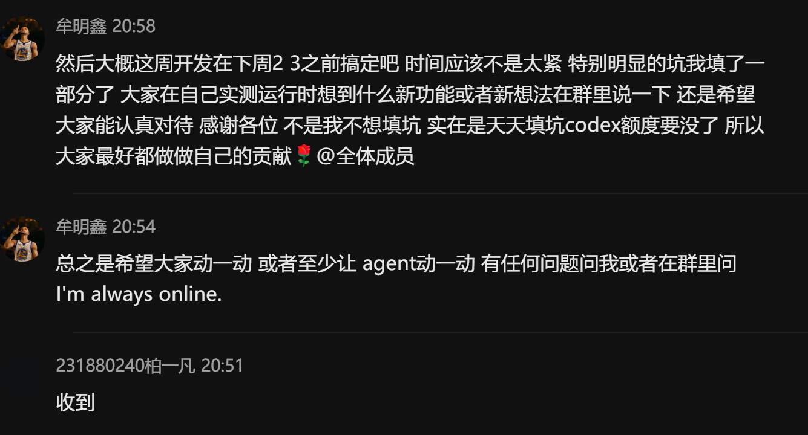
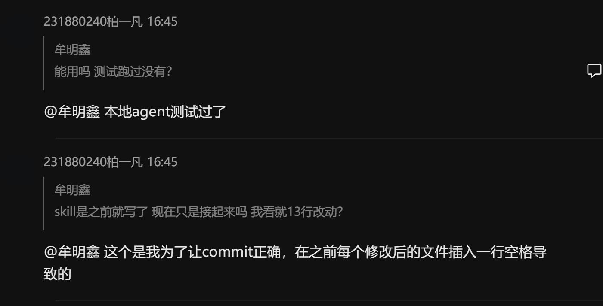
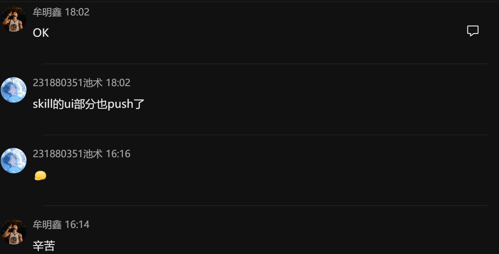

# 会议记录

更新时间：2026-06-19

本文记录迭代三产品化阶段的主要讨论与决策，便于答辩时说明“为什么这样做”。

## 1. 会议一：明确产品定位与课程要求

时间：2026-05 下旬

参与角色：项目组成员、后端、前端、组长

### 讨论内容

- 阅读迭代三任务说明，确认本阶段重点是 Agent 产品化。
- 对比课程要求，项目不能只停留在“能调用 LLM”或“堆功能”。
- 明确需要形成完整 Agent 应用、合理 UI、文档和优化记录。

### 决策

- 产品定位确定为“证据驱动的科研调研与选题决策助手”。
- 以科研调研主链作为演示主线：
  - 新建研究。
  - 检索或导入论文。
  - 生成结构化结果。
  - 多轮追问。
  - 汇总研究总览。

### 后续行动

- 阅读并整理 `docs/`。
- 梳理代码中的主链能力。
- 以 PDF 要求为依据制定补齐计划。

## 2. 会议二：确定主线二与后端分步实现

时间：2026-06 上旬

### 讨论内容

- 判断项目已有基础，不适合推翻重写。
- 主线选择“科研调研助手产品化”，而不是做无关功能拼盘。
- 后端先完成研究任务、消息、workspace、论文检索和追问闭环。

### 决策

- 保持现有代码结构，避免大规模重构。
- 按小步推进：
  - task 和 workspace 后端。
  - follow-up task。
  - 论文检索和补搜。
  - RAG 和 working memory。
  - 前端工作台展示。

### 后续行动

- 增加 research task 与 task events。
- 前端接入追问自动运行和结果跳转。
- 后端记录 source trace，便于解释每轮检索策略。

## 3. 会议三：检索质量与 bad case 复盘

时间：2026-06 中旬

### 讨论内容

手动测试中发现多个 bad case：

- 追问“近两年/近三年”后没有补搜。
- 搜不到论文时出现 seed 或保底论文。
- 核心论文混入跑题论文。
- 引用数未知显示为 `0`。
- 研究总览覆盖旧结果或丢失元数据。
- 演进图关系全是 related 或强关系证据不足。

### 决策

- 产品价值应优先体现在“查得到、查得准、结论有证据”。
- 建立检索质量评测集和主链验收用例。
- 共享知识只能作为上下文，不能越过论文池直接支撑结论。

### 后续行动

- 建立 `evaluation/retrieval_cases.json`。
- 建立 `evaluation/main_chain_cases.json`。
- 编写 [检索质量评测说明](检索质量评测说明.md) 和 [主链质量验收说明](主链质量验收说明.md)。

## 4. 会议四：PDF 导入、知识库与 RAG 边界

时间：2026-06 中旬

### 讨论内容

- 用户希望能在研究前批量导入 PDF。
- 用户上传论文应该参与当前研究，而不是只进入全局知识库。
- 全局共享知识如果无过滤，可能污染当前结论。

### 决策

- 区分当前研究私有知识和全局共享知识。
- 新建研究支持先选择 PDF，但不自动生成结果。
- 研究方式支持 `hybrid / imported_only / search_only`。
- Context 区需要解释知识命中的用途和边界。

### 后续行动

- PDF 导入写入 KnowledgeDocument 和 ConversationResearchPaper。
- workspace 展示论文来源。
- RAG 命中展示 evidence_level 和 supporting snippets。

## 5. 会议五：研究总览、论文详情与图谱可信度

时间：2026-06 中旬至 2026-06-18

### 讨论内容

- 工作台内容太多，需要拆分视图。
- 研究总览应该体现多轮沉淀，而不是只看最新一轮。
- 论文详情不能只展示元数据，需要告诉用户“为什么读”。
- 图谱不能用普通主题相似冒充引用、改进或扩展关系。

### 决策

- 工作台拆成 Overview / Evidence / Map / Context / Run。
- Paper Brief 改为阅读决策卡。
- 演进图关系必须保守，强关系需要证据。
- 研究简报需要解释核心论文选择依据、领域格局和下一步动作。

### 后续行动

- 增加 `research_brief`。
- 增加 `paper_brief` 和 claim checks。
- 优化图谱节点、边类型、边证据和筛选。

## 6. 会议六：Agent 运行可视化与用户等待体验

时间：2026-06-16 至 2026-06-18

### 讨论内容

- 用户等待生成时只看到日志或 loading，体验较差。
- 需要让用户知道 Agent 正在规划、检索、审计还是生成结果。
- 运行画板有时在结果刷新前提前收起。

### 决策

- 使用 task events 驱动 Agent Node 运行图。
- 节点包括 Planner、Searcher、Taxonomy、Evolution、Auditor、Corrector、Synth、Result。
- 运行结束后，画板应等待历史和结果刷新后再自动收起。

### 后续行动

- 接入 `GET /research/tasks/{task_id}/events`。
- 前端在首轮生成和追问生成时展示运行图。
- 修正 terminal status 过早关闭画板的问题。

## 7. 会议七：交付文档与评测数据归档

时间：2026-06-18

### 讨论内容

- 根据课程截图要求，需要明确交付：
  - Agent 优化文档。
  - 优化过程使用的评估数据集。
  - 需求分析、详细设计、会议记录等文档。

### 决策

- 新增显式交付文档，避免评审需要从路线图里猜。
- 评估数据集统一指向 `evaluation/`。
- 历史评测输出统一指向 `outputs/retrieval_eval/`。

### 后续行动

- 新增 [Agent优化文档](Agent优化文档.md)。
- 新增 [评估数据集归档说明](评估数据集归档说明.md)。
- 新增本会议记录、需求分析和详细设计文档。

补充部分聊天记录截图：

 
 
